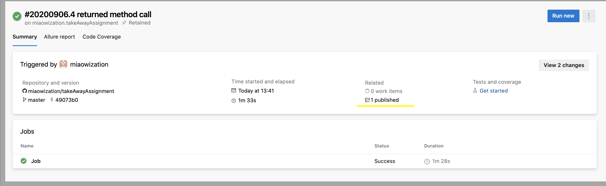
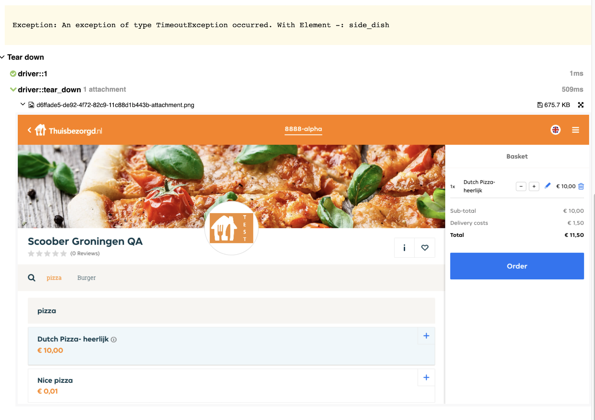

# Setup project

Tech stack:
- Python
- Pytest as a test runner
- Allure as a test reporting tool
- GitHub Pages to host test results
- Selenium as a browser automation tool

There are 2 ways how you can get run the tests: locally on your computer or 
in Azure Devops pipeline which I created to relieve you from setting up 
the environment needed to run tests.

###### If you want to do it easy way:
1. Open the link 
https://gabidulina.visualstudio.com/takeAwayQAAssignment/_build?definitionId=1 
in your browser. There you will find a pipeline with these steps:
- Checkout repository
- Install Google Chrome
- Install Allure
- Install Firefox
- Install python requirements
- Run tests with Pytest in headless browser, by default Firefox
- Generate test report with Allure
- Send test report to Github Pages

Unfortunately the pipeline can be started only if you have permission to start it. 
So if you want to do it yourself please contact me in Telegram @AigulValieva 
or by e-mail aigul.g.r@gmail.com.

Otherwise you can just open previously runned jobs and look at the results. 
Test report can be found here https://miaowization.github.io/takeAwayAssignment.
Also it is published as pipeline artifact.
 

###### If you want to do it the hard way follow instruction:
1. Clone the repository and go to the project folder.
2. Install Google Chrome or Firefox if you don't have it.
3. Install requirements
`pip install -U -r requirements.txt`
4. Install allure. If you have Mac OS X and you have Homebrew just execute command in terminal
` brew install allure`. 
Or else see installation steps in documentation https://docs.qameta.io/allure/#_get_started

5. To run tests execute command `pytest --alluredir=tmp/my_allure_results`.
That will run all the tests in headless mode in Firefox browser and create a test report.
If you wish to run tests in Chrome or in a ordinary window browser try these in cmd:

- `pytest tests --headless True --browser Firefox --alluredir=tmp/my_allure_results`
 
 - `pytest tests --headless False --browser Chrome --alluredir=tmp/my_allure_results`
 
 There is a problem with chromedriver in headless mode, so I do not recommend using it. 
 However in window mode everything is okay.
 
6. To open HTML test report execute command `allure serve tmp/my_allure_results` 
This will start local server and open test report. 
If test failed you can find the screenshot of a failure in Tear Down section of a report.
 

